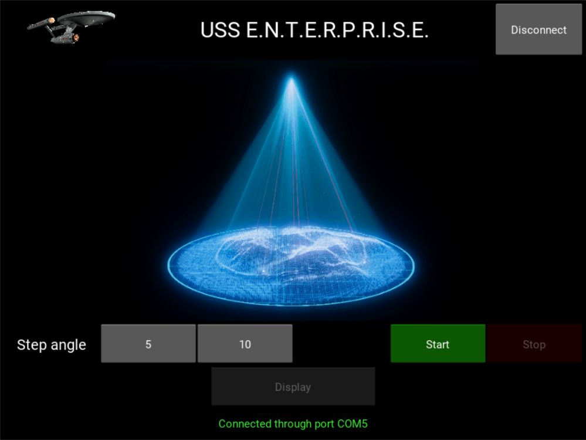

# AY2021_II_Project_1-1
Code and files for the Final Project 1 - Variant 1. Academic Year 2020/2021, II Semester

Our project consists in developing a system able to perform a three-dimensional scanning of an object using two servomotors (MG996R) and one ultrasonic sensor (HCSR04). Our sonar must be opportunely moved to detect the distance surfaces in the field of view of the USS.

<h2>Software requirements</h2>
In order to let the device perform the functionality previously described, some software requirements must be fulfilled. Since our codes are written in PSoC and python, the following IDEs and softwares must be downloaded:
<ul>
  <li>PSoC Creator</li>
  <li>Kivy</li>
  <li>Visual Studio Code</li>
  <li>MATLAB 2017b version</li>
</ul>

<h2>Hardware requirements</h2>

In order to create our device different components have been used. 
<ul>
  <li>Two servomotors</li>
  <li>Connection elements in order to link the two servomotors and create a serial chain able to scan the proximal environment
  <li>An ultrasonic sensor, the HCSR04</li>
  <li>A cypress board</li>
  <li>An homemade wooden box that acts as a housing for the board and guarantees robustness and stability to the serial chain</li>
</ul>
All these components must be properly handled as follow.

<h3>Board settings</h3>

It is placed inside the wooden box and it is powered by the computer. The connection between the board and the computer can be performed using any COM the user wants, it will be recognized by our code. 

<h3>Servomotors settings</h3>

The first servomotor must be connected to 2.6 PIN and it must have the crankshaft positioned vertically. The second servomotor must be connected at the 2.7 PIN and placed at the top of the first servomotor with the crankshaft positioned horizontally. Both of the servos need an external power supply in order to work properly.  

<h3>Ultrasonic sensor settings</h3>

The HCSR04 must be linked at the crankshaft of the second servomotor through a special connection element in order to move solidly with this crankshaft. It works thanks to two connections, the Echo, the Trigger, that must be connected respectively to the 2.5 and 2.4 PINs.

<h3>Complete device arrangement</h3>

In this repository it can be found the solidworks file where our configuration is graphically shown. It is possible to recreate the device following the image, as long as the user has all the components listed before. 

<h2>Calibration and angle-coordinates conversion</h2>

It is possible to see and understand the conversion from angles to three-dimensional coordinates in the ..... file. In the following chapter it will be described the computation that allows the representation of the object putted in front of our device.

<h3>X-Y-Z system</h3>

The Z-axis is the extension of the crankshaft of the first servomotor and it remains integral with it. This servomotor is placed in the exact middle of the X-axis so that the bottom of its crankshaft consists in the origin of the reference system. Y-axis is aligned with the direction of the long side of the first servo motor. REMEMBER: the second servomotor rotates jointly and solidally with the crankshaft of the first servomotor.

<h3>Angles description</h3>

 
The rotation of the crankshaft 1 allows to sweep the XY plane, its motion is described by the alpha angle. <i>Alpha is the angle between the Y-axis and the plane perpendicular to XY, containing the point detected and aligned with the direction of the arm to which the sonar is linked.</i> 
The rotation of the crankshaft 2 allows to sweep the plane perpendicular to XY and aligned with the direction of the long side of the second servomotor and its motion is described by the beta angle. <i>Beta is the angle between the straight line determined by the arm to which the sonar is attached and the plane on which the crankshaft of the second servo motor lies.</i> 
Functions getPosition() and setPosition(X°) allow to return and set the angle (degrees) of one servomotor respectively.  

First servomotor: 
<ul>
  <li>0 angle: lies on the positive portion of the X-axis</li>
  <li>90 angle: lies on the positive portion of the Y-axis</li>
  <li>180 angle: lies on the negative portion of the X-axis</li>
</ul>

Second servomotor:
<ul>
  <li>0 angle: due to structural reason it consists in a 60° angle between the Z-axis and the straight line which is the extension of the arm to which the sonar is linked.</li>
  <li>60 angle: 0 angle + 60° = 120° (almost)</li>
</ul>

According to the information reported: 

SERVO_MID_ANGLE=90 
ANGLE_ZERO=60 
<i>alpha = SERVO_MID_ANGLE-Servo_GetPosition1()</i> 
<i>beta = Servo_GetPosition2()+ANGLE_ZERO-SERVO_MID_ANGLE</i> 

<h3>Coordinates computation</h3>

Knowing that :
<ul>
  <li>D2 is the distance between the middle of the crankshaft of the second servomotor and the Z-axis</li>
  <li>ARM_LENGTH is the length of the connection component that allows the rotation of the sonar solidally with the second crankshaft</li>
  <li>pos_servo1_rad is alpha in rad</li>
  <li>pos_servo2_rad is beta in rad</li>
  <li>pos_servo2_z_rad is beta+ANGLE_ZERO° in rad</li>
  <li>Z1 is the height of the crankshaft of the second servomotor</li>
</ul>
the coordinates computed using those two angles are: 

<i>X=(D2+(ARM_LENGTH+distance_real)*cos(pos_servo2_rad))*sin(pos_servo1_rad);</i> 
<i>Y=(D2+(ARM_LENGTH+distance_real)*cos(pos_servo2_rad))*cos(pos_servo1_rad);</i> 
<i>Z=Z1-(ARM_LENGTH+distance_real)*cos(pos_servo2_z_rad);</i> 

<h2>Configuration through GUI</h2>

Our GUI consists in six buttons: 
<ul>
  <li>Connect</li>
  <li>Start</li>
  <li>Stop</li>
  <li>Step angle, with two possibilities</li>
  <li>Display</li>
</ul>
and in a space that, at the end of the acquisition, will be filled with the reconstructed image after 'display' button has been pushed. 

<h3>UART communication settings</h3>

The user has the chance to connect automatically the GUI with the device through UART communication by pushing the button 'Connect'. If a board programmed with our code is connected to the computer, it will send back the string 'Device succesfully connected$' and our computer will understand which is the right COM to use. It will be possible to see at the bottom of the GUI the connection status. 

<h3>Step angle settings</h3>

The user can also configure the <em>Step angle</em> of the servomotors through our GUI. This operation allows the user to obtain a more defined image by increasing the steps of the servomotors and so the number of points that describe the surface.

<h3>Start and Stop commands</h3>

The user has to press the 'Start' button in order to start the three-dimensional scanning and the 'Stop' button can be pressed anytime the user wants. After the 'Stop' button has been pressed our device will come back at the 'zero configuration', ready to begin a new scanning process.

<h3>Display command</h3>

This button will be disabled until the end of the acquisition. Once the acquisition is done the 'display' button will be activated. The user will be able then to push it and display the reconstructed image.  The user has also the chance to change the perspective of the object using the mouse and by pushing the 'p' key a screenshot will be performed and saved in the repository. 

<h2>Operating instructions</h2>

Due to its dimensions and due to specific hardware limits, this device is able to understand the shape and concavity of an object with small dimensions. The object, moreover, must be placed at a distance of --- cm in order to have a higher quality reconstruction, otherwise the device will not be able to detect properly the object's surface. 
Sweep on the XY plane is performed with a 100° angle; more specifically, the first servo motor goes from 40° to 140°, so alpha will go from 50° to -50°. The object should be put at the centre of this range in order to let the device scan the entire shape. Please be adviced that, by nature, the sonar will return correct distances only for points on planes parallel or almost parallel to it. Our device, instead, works by rotating around two pins, and it does not use sliding tracks. For this reason, distances detected at the limits of our 100° range could be affected by bias. In order to manage this conditions we decided to narrow the sweeping range to 100° and to
suggest the user to scan small dimension objects. By doing this we let the sonar to work in its optimal conditions. 