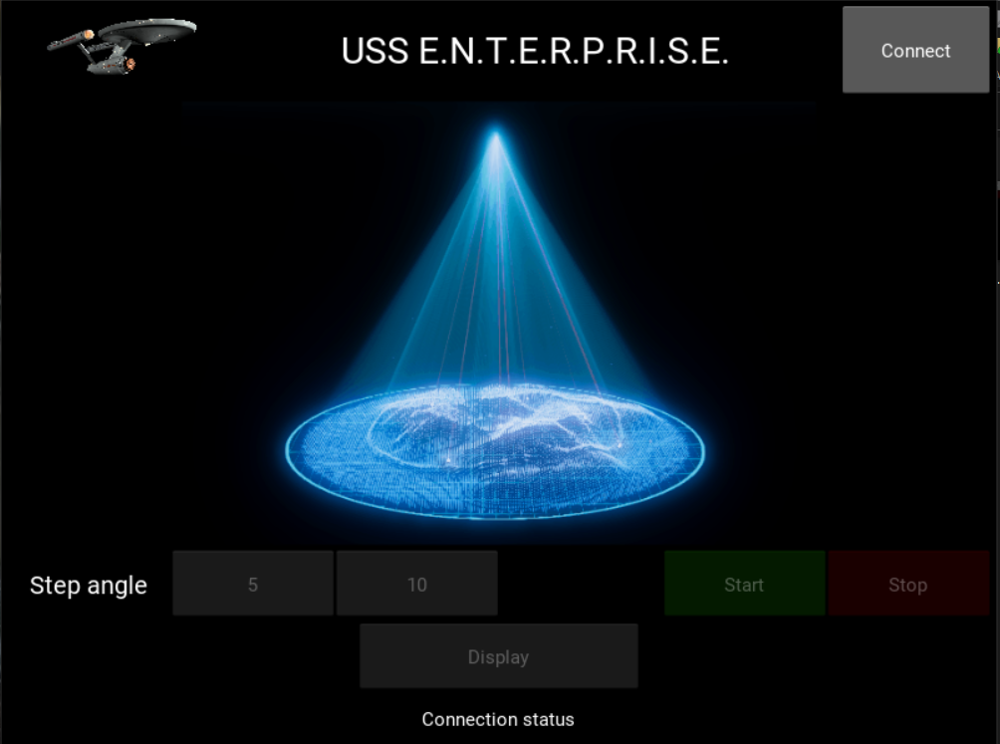

# AY2021_II_Project_1-1
Code and files for the Final Project 1 - Variant 1. Academic Year 2020/2021, II Semester

Our project consists in developing a system able to perform a three-dimensional scanning of an object using two servomotors (---) and one ultrasonic sensor (HCSR04). Our sonar must be opportunely moved to detect the distance surfaces in the field of view of the USS.

<h2>Software requirements</h2>
In order to let the device perform the functionality previously described, some software requirements must be fulfilled. Since our codes are written in PSoC and python, the following IDEs and softwares must be downloaded:
<ul>
  <li>PSoC Creator</li>
  <li>Kivy</li>
  <li>Visual Studio Code</li>
</ul>

<h2>Configuration through GUI</h2>

Our GUI consists in six buttons: 
<ul>
  <li>Connect</li>
  <li>Start</li>
  <li>Stop</li>
  <li>Step angle, with three possibilities</li>
</ul>
and in a space that, at the end of the acquisition, will be filled with the reconstructed image. 

<h3>UART communication settings</h3>

The user has the chance to connect automatically the GUI with the device through UART communication by pushing the button 'Connect'. If a board programmed with our code is connected to the computer, it will send back the string 'Device succesfully connected$' and our computer will understand which is the right COM to use. It will be possible to see at the bottom of the GUI the connection status. 

<h3>Step angle settings</h3>

The user can also configure the <em>Step angle</em> of the servomotors through our GUI. This operation allows the user to obtain a more defined image by increasing the steps of the servomotors and so the number of points that describe the surface.

<h3>Start and Stop commands</h3>

The user has to press the 'Start' button in order to start the three-dimensional scanning and the 'Stop' button can be pressed anytime the user wants. After the 'Stop' button has been pressed our device will come back at the 'zero configuration', ready to begin a new scanning process.

<h2>Hardware settings</h2>

In order to create our device different components have been used. 
<ul>
  <li>Two servomotors</li>
  <li>Connection elements in order to link the two servomotors and create a serial chain able to scann the proximal environment
  <li>An ultrasonic sensor, the HCSR04</li>
  <li>A cypress board</li>
  <li>An homemade wooden box that acts as a housing for the board and guarantees robustness and stability to the serial chain</li>
</ul>
All these components must be properly handled as follow.

<h3>Board settings</h3>

It is placed inside the wooden box and it is powered by the computer. The connection between the board and the computer can be performed using any COM the user wants, it will be recognized by our code. 

<h3>Servomotors settings</h3>

The first servomotor must be connected to --- PIN and it must have the crankshaft positioned vertically. The second servomotor must be connected at the --- PIN and placed at the top of the first servomotor with the crankshaft positioned horizontally. Both of the servos need an external power supply in order to work properly.  

<h3>Ultrasonic sensor settings</h3>

The HCSR04 must be linked at the crankshaft of the second servomotor through a special connection element in order to move solidly with this crankshaft.

